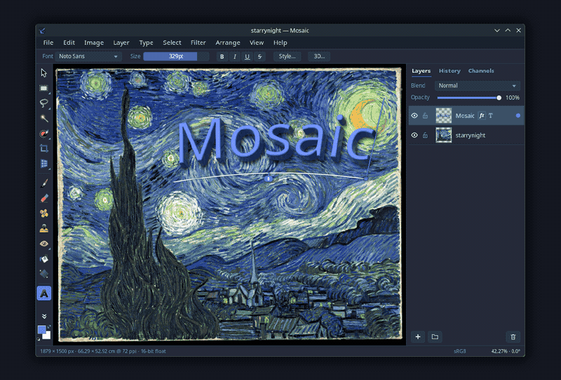

> [!WARNING]
> **Development is paused indefinitely, and this is alpha software.** The feature surface is
> broad; the polish is not.
>
> - The **Windows** port is buggy. Running it under Wine causes rapid flashing — **do not run it
>   if you have epilepsy.**
> - The **macOS** Quick Look and thumbnail extensions may not work, and can make Finder hang. They
>   install automatically when you open the DMG — Apple's design, not a choice Mosaic makes.
> - **Performance degrades on large documents**, on every platform.
>
> **This project is not sponsored or endorsed by Anthropic.**

<h1 align="center">Mosaic</h1>

<p align="center">
  A GPU-accelerated image editor for Linux, Windows and macOS.<br>
  Written by Claude, designed by a human.
</p>

<p align="center">
  <a href="https://github.com/mosaic-devel/mosaic/releases/latest"><b>Download</b></a> ·
  <a href="#building">Build from source</a> ·
  <a href="PLAN.md">Development record</a>
</p>



Mosaic is a C++20 image editor built on Vulkan compute. Compositing, filters, layer effects and
brush rendering run on the GPU against a tiled document model; the whole application — including
the Windows and macOS builds — is compiled from Linux.

## Download

Prebuilt binaries for every platform are on the
[releases page](https://github.com/mosaic-devel/mosaic/releases/latest).

| Platform | Format | Notes |
| --- | --- | --- |
| Linux x86-64 / ARM64 | AppImage | glibc 2.39 floor — Ubuntu 24.04+, Debian 13+, Fedora 40+, rolling |
| Windows x64 / ARM64 | MSI (per-user) or portable zip | ARM64 has never been run on hardware |
| macOS 13.3+ | Universal DMG | Apple Silicon and Intel in one bundle |

A **Vulkan 1.2** driver is required on Linux and Windows. macOS runs on MoltenVK, which ships
inside the bundle. Nothing is signed by a certificate authority, so each OS will object once —
the release notes give the exact click-through per platform.

## What it does

**Documents and compositing.** A tiled document model with raster, vector, text, group,
adjustment and texture layers, composited by Vulkan compute shaders. Layer masks, clipping,
blend modes, non-destructive adjustment layers, and layer effects — outlines, shadows, glows, and
colour, gradient and pattern overlays.

**Painting.** Krita's brush engine, transcribed — roughly 90% compatible with Krita's default
brush set, which ships with the application. Pressure-sensitive tablet input on Wayland
(`zwp_tablet_v2`), X11 (XInput2) and Windows (WinTab and Windows Ink).

**Type.** An OpenType text engine over HarfBuzz and FreeType: vertical writing modes, RTL,
text on a path or conformed to a shape, bending, 3D extrusion, hyphenation and spell-checking
through each platform's own service.

**Vector.** A pen tool, editable paths, a shape gallery, and a large vector pattern gallery.

**Generation.** An inpainting engine with outpainting, **Smart Resize** and **Smart Recompose**
for reframing an image without distorting what matters in it, and a procedural texture generator
that includes a physically-based day/night sky with volumetric clouds.

**Colour.** ICC colour management through lcms2, with soft-proofing against a bundled FOGRA39
CMYK press profile.

**Formats.** PNG, JPEG, TIFF, WebP, AVIF, JPEG XL, GIF, BMP, TGA, QOI, PNM, ICO and Radiance
HDR, with EXIF preserved on read and write. Export goes through a registry-driven dialog whose
options panel is generated from each backend's own schema, and whose preview is the *decoded
encoded bytes* — so a JPEG preview shows its own artefacts, and the reported file size is exact.

**Elsewhere.** Dark and light themes that follow the system, an interface translated into 74
languages, desktop integration on all three platforms (file associations, thumbnailers, Quick
Look), and **no telemetry of any kind**.

## The `.mosaic` file format

Every mainstream editor format — PSD, PSB, XCF, KRA, ORA — stores your work with no error
correction and no history. A corrupted byte in the wrong place costs you the file, and your undo
stack dies with the process.

`.mosaic` carries Reed–Solomon parity, can salvage past a damaged frame rather than giving up at
it, keeps the undo history inside the document, and backs unsaved work with an app-owned recovery
journal that survives a hard kill without ever touching your file until you press Save. Saves cost
O(current content + new history) rather than O(session length), because already-checkpointed
history is verify-then-copied byte-verbatim instead of re-encoded.

It was designed against measurements rather than intuition: six container designs benchmarked for
corruption resilience, save speed and compression; four-plus undo-history designs benchmarked for
storage, timing and corruption behaviour; roughly 500 adversarial checks across both. The shipped
format detects 11 of 11 mutations in its corruption battery.

See [`docs/mosaic-native-format.md`](docs/mosaic-native-format.md) for the container design.

## Building

Everything is built **from Linux**, including the Windows and macOS targets. There is no Visual
Studio build and no Mac is required.

Mosaic prefers **system-installed** dependencies. You need a C++20 toolchain, CMake ≥ 3.25, Ninja,
and the Vulkan loader plus headers. The configure step prints exactly which optional libraries it
found or is missing.

### Dependencies

**Required:** Vulkan (loader + headers), **FLTK 1.4**, spdlog, lcms2, FreeType, HarfBuzz,
enchant-2, libhyphen, libpng, libjpeg-turbo, zlib, zstd, lz4, fontconfig, expat, libsystemd,
libXi, libXrandr, and wayland-client + wayland-protocols + wayland-scanner. A SPIR-V compiler
(`glslc` from shaderc, or `glslangValidator`) is needed at build time.

**Optional**, each probed and cleanly disabled when absent: libjxl, libwebp, libavif, libtiff,
giflib, libcanberra, and KF6KIO (for the KDE thumbnail plugin).

```bash
# Arch / CachyOS
sudo pacman -S --needed base-devel cmake ninja git pkgconf \
    vulkan-headers vulkan-icd-loader shaderc fltk spdlog \
    lcms2 freetype2 harfbuzz enchant hyphen \
    libpng libjpeg-turbo libtiff libwebp libavif libjxl giflib \
    zlib zstd lz4 fontconfig expat \
    systemd-libs libxi libxrandr libcanberra \
    wayland wayland-protocols gettext

# Debian / Ubuntu — note that FLTK 1.4 is NOT packaged before Debian 13 / Ubuntu 25.04
# and must be built from source on older releases.
sudo apt install build-essential cmake ninja-build git pkg-config \
    libvulkan-dev glslang-tools libspdlog-dev \
    liblcms2-dev libfreetype-dev libharfbuzz-dev libenchant-2-dev libhyphen-dev \
    libpng-dev libturbojpeg0-dev libtiff-dev libwebp-dev libavif-dev libjxl-dev libgif-dev \
    zlib1g-dev libzstd-dev liblz4-dev libfontconfig1-dev libexpat1-dev \
    libsystemd-dev libxi-dev libxrandr-dev libcanberra-dev \
    libwayland-dev wayland-protocols libwayland-bin gettext
```

### Configure, build, test

```bash
git clone https://github.com/mosaic-devel/mosaic.git && cd mosaic
cmake --preset linux-debug
cmake --build --preset linux-debug
ctest --preset linux-debug
./build/linux-debug/bin/mosaic --version
```

Use `linux-release` for an optimized build, or `linux-asan` for AddressSanitizer/UBSan. Warnings
are errors on every preset.

### Packaging

```bash
bash packaging/linux/make-appimage.sh          # -> build/linux-appimage/Mosaic-<v>-<arch>.AppImage
```

An AppImage cannot bundle glibc, so its compatibility floor is whatever glibc it was built
against. CI builds the published images on Ubuntu 24.04 for that reason; building on a rolling
distribution produces an image that runs only on rolling distributions.

### Cross-compiling for Windows

Via **MinGW-w64**, for two architectures: **x86-64** through the system mingw-w64 GCC, and
**ARM64** through **llvm-mingw**, which is the only Linux-hosted toolchain that can target
Windows-on-ARM. Third-party libraries are cross-built as DLLs that ship beside `mosaic.exe`.
See [`docs/build-windows.md`](docs/build-windows.md) and
[`packaging/windows/README.md`](packaging/windows/README.md).

```bash
export MOSAIC_WIN_PREFIX=/scratch/win/deps/x86_64
MOSAIC_WIN_ARCH=x86_64 bash packaging/windows/build-deps.sh
bash packaging/windows/make-package.sh x86_64   # -> portable zip + per-user MSI
```

### Cross-compiling for macOS

Via **osxcross + MoltenVK**, into a universal (arm64 + x86-64) `Mosaic.app` and a
drag-to-Applications `.dmg`, built entirely on Linux with no Mac and no root. The bundle is
**ad-hoc signed**, which is not cosmetic: the Apple Silicon kernel refuses to execute an unsigned
arm64 binary at all. It carries no Developer ID and is not notarized, so Gatekeeper still asks.
See [`docs/build-macos.md`](docs/build-macos.md) and
[`packaging/macos/README.md`](packaging/macos/README.md).

```bash
bash packaging/macos/make-dmg.sh               # -> build/macos-dmg/Mosaic.dmg
```

## Repository layout

| path | contents |
| --- | --- |
| `src/core` | document model, layers, brushes, text, vector, inpainting, texture generation |
| `src/render` | Vulkan device, compositor, filter and effect compute pipelines |
| `src/io`, `src/formats` | the `.mosaic` container, image codecs, the export registry |
| `src/ui`, `src/platform` | FLTK-based interface; per-platform windowing, tablet, dialogs |
| `packaging/` | AppImage, Windows zip/MSI, and macOS DMG pipelines |
| `docs/` | one design note per subsystem |
| `PLAN.md` | the development record: architecture, licence matrix, session-by-session history |

The application icon is a single SVG at [`assets/app_icon.svg`](assets/app_icon.svg), rasterized
to each platform's icon format at build time. Replace that one file to rebrand.

## Contributing

Conventions live in [`PLAN.md`](PLAN.md) §8: `.clang-format` (LLVM-based, 4-space, 100 columns),
Conventional Commits, linear history, and a green `ctest` on every commit. CI builds and tests
each push in an Arch Linux container and holds changed files to the format bar.

## Licence

Mosaic is licensed under the **GNU General Public License v3.0** — see [`LICENSE`](LICENSE).
Third-party components and their (GPLv3-compatible) licences are listed in
[`docs/third-party-licenses.md`](docs/third-party-licenses.md).
